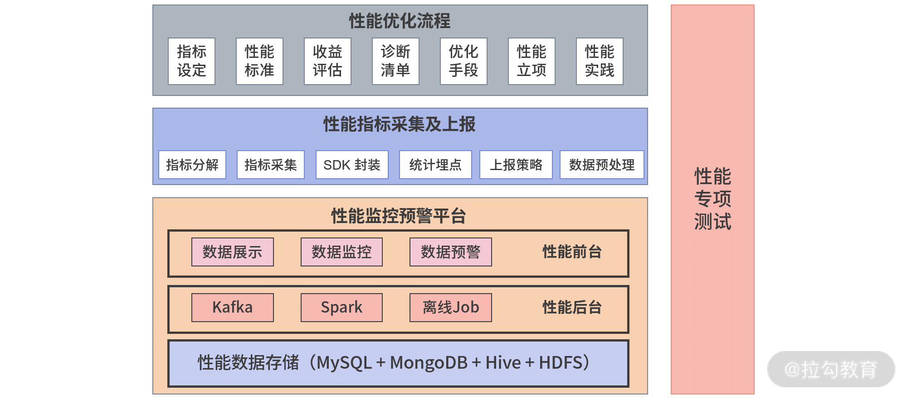

## 简介

### 为什么做性能优化？

随着互联网的迅速发展，现在的网站内容越来越丰富，用户对网站的性能要求也越来越高，可以说性能是web网站和应用的支柱，我们要关注用户的流量、SEO、转换率、用户体验等一系列问题。其中当下性能优化面临的最大挑战就是来自移动端的挑战，主要有以下3点：

1. 受硬件设备的影响，加载速度慢，网络环境不好，屏幕尺寸小，交互方式复杂
2. 用户更缺少耐心，>3秒加载可能导致53%的跳出率
3. 持续增长的移动用户和电商业务

### 性能优化体系

在实际工作当中，想要学习和掌握前端性能优化，常常会许多难点，比如成体系的性能优化资料严重缺失、性能监控预警平台没有开源，需要自己去开发等问题。所以最近我阅读了很多教程，终于找到一个一套大而全的性能优化体系图谱。

### 一、性能优化流程

#### 1. 性能指标设定

首先要确定我们要选择什么样的指标。比如页面打开慢，我们想要优化它，该从哪些地方入手，优化完后怎么知道问题解决了？这些就需要明确的指标来衡量。

1. 行业标准
2. 优化模型
3. 性能测量APIs

#### 2. 确定性能标准

我们性能优化目标是怎样的，优化到什么程度合适。例如，我们要优化 App 里面的 H5 页面打开速度，确定的指标是秒开率，那一秒内可以打开的请求比例就是它的性能标准。主要有以下测量工具：

1. WebPageTest
2. LightHouse
3. Chrome DevTools

#### 3. 收益评估

如果仅仅判断性能指标是否优化到位还好，但很多时候，为了让产品同学感觉我们是为产品服务，而不是又在造轮子，我们还需要关联产品目标进行收益评估。比如，列表页到详情页的转化率能不能提升？用户跳出率可不可降低？

#### 4. 诊断清单

把业务代码接入性能监控预警平台，根据性能标准给出诊断清单。

#### 5. 优化手段

假如诊断出性能问题，我们就可以结合性能标准和诊断清单，确定相应的优化手段。

##### 性能优化有哪些方面？

1. 传输加载优化：Gzip、KeepAlive、HTTP 缓存、Service Worker、HTTP/2、SSR、Nginx
2. 资源优化
   - 压缩&合并
   - 图片格式
   - 图片加载
   - 字体优化
3. 渲染优化
   - 现代浏览器渲染原理
   - 可视化的渲染环节和方法
4. 构建优化
   - webpack 优化配置
   - 代码拆分
   - 代码压缩
   - 持久化缓存
   - 监测与分析
   - 按需加载
5. 代码优化
   - JS优化
   - HTML优化
   - CSS优化

##### 常见的性能优化手段有哪些？

1. SVG优化图标
2. FlexBox布局
3. 预加载
4. 预渲染
5. 窗口化提高列表性能
6. 骨架组件

#### 6. 性能项目立项

赢得产品经理、后端同事支持，让优化顺利执行下去

#### 7. 性能实践

经过优化之后发起项目上线，并跟踪进行效果评估，结合场景把这些项目成果以文档或代码的形式沉淀下来，给后来者使用参考。

### 二、性能指标采集与上报

主要内容是把前面提到的性能指标以代码的形式分解落地，确保可以采集，然后在 SDK 封装后集合统计埋点，最后根据实际情况，制定上报策略。在上报之前，我们还需要注意将一些“脏数据”（也就是明显异常的数据）丢弃掉，避免占用用户网络带宽。

### 三、性能监控预警平台

主要是通过分析上一步采集到的性能数据，再对比性能标准进行监控。当指标超过某一监控阈值时，性能监控预警平台会通过邮件或者短信，给我们发送预警信息。

在构造上，性能监控预警平台包括：性能数据处理后台和性能可视化展现前台两部分。

#### 性能数据处理后台

主要是在性能采集数据上报到性能平台后，对数据进行预处理、数据清洗和数据计算，然后生成前台可视化所需数据。

#### 性能可视化展现前台

包括性能展示、性能监控预警，主要是对核心数据指标进行可视化展现，对性能数据波动进行监控，对超出阈值的数据给出短信或邮件报警。

最后为了确保没问题，在上线前一定要做性能专项测试，检查一下你采取的措施和性能优化预期是否一致。比如，能否正确发出请求，请求处理流程是否正确，性能平台数据能否展现。如果不一致，那就得继续优化。

以上就是整个性能体系的优化流程和核心内容了。

### 小结

1. 性能优化体系是由**性能优化流程，性能指标采集及上报、性能监控预警平台**三大部门组成
2. 性能优化流程中应当注意结合产品进行收益评估、列出诊断清单、确定手段和记得项目立项。
3. 性能采集上班和预警平台是前端监控领域针对于性能优化的一个监控模型，使我们第一时间发现问题。

## 最后

学习性能优化并不仅仅是掌握一些优化技巧就可以了。特别要注意的是，进行性能优化，指标就是我们的一个抓手，首先你就要确定它的指标，然后才能根据指标去采取措施，否则就会像无头苍蝇一样乱撞，没有执行目标。

文中如有错误，欢迎在评论区指正，如果这篇文章帮助到了你，欢迎点赞和关注。

阅读更多优质文章、可以关注我的微信公众号【阳姐讲前端】，每天推送高质量文章，我们一起交流成长。

## 最后

文中如有错误，欢迎在评论区指正。

如果这篇文章帮助到了你，欢迎点击「**在看**」，让更多的人也能看到这篇内容。

扫描下方二维码关注 **#公众号：阳姐讲前端**，每天推送高质量文章，我们一起交流成长。

